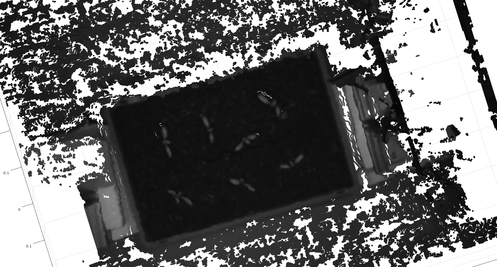
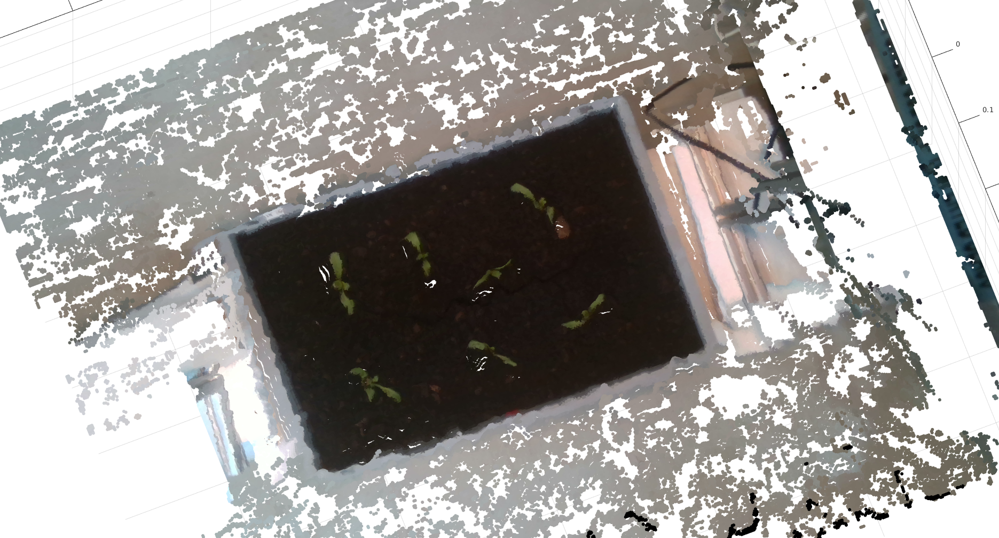
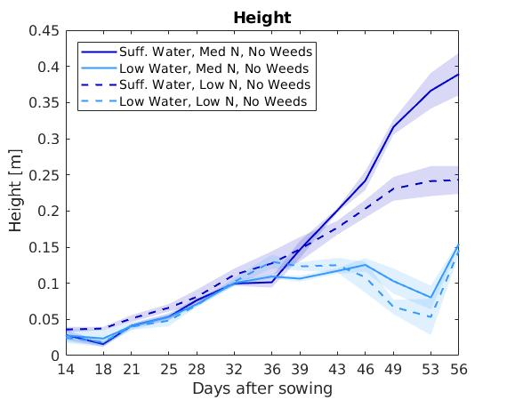
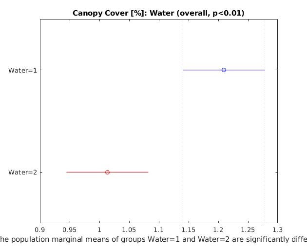

# Plant Stress Phenotyping
## Computer Vision based crop phenotyping routines

### Authors
>Raghav Khanna  
>Lukas Schmid  
Autonomous Systems Lab  
ETH Zurich

### Contribute

1. Fork or branch
2.  Please adhere to the following [styleguide](https://sites.google.com/site/matlabstyleguidelines/documentation)
3. Send a PR and tag me

### Citation

If you find this repository useful in your scientific work, please consider citing

>A Spatio Temporal Spectral Dataset for Plant Stress Phenotyping by Khanna, Raghav and Schmidt, Lukas and Nieto, Juan and Siegwart, Roland and Liebisch, Frank  
>A Bayesian Framework for Plant Stress Phenotyping by Raghav Khanna, Lukas Schmid, Juan Nieto and Frank Liebisch

### Dependencies
Some functionality depends on the following third party software

- [caltag](https://github.com/raghavkhanna/caltag)

### Usage
- Scripts are configured to be run from the root `plant_stress_phenotyping` folder by default.

### Data Index
| Filename | Folder | Description |  
|----|----|----| 
|`CMV2K-SSM5x5-600_875-5.5.9.2.xml`|[spectral_image](spectral_image/CMV2K-SSM5x5-600_875-5.5.9.2.xml)| Spectral response data for the Ximea camera, lens and filter setup used for the dataset|
### Code Index
#### Camera Calibration, 3D reconstruction and Multispectral Reprojection
Folder `3dprocessing` contains utility functions for intrinsic and extrinsic camera calibration, stereo reconstruction and reprojection used for creating the spatio-spectral point clouds.

| Filename | Type | Description |  
|----|----|----|  
|`calibratecameraarray.m`|*function*|Calibrate a set of N cameras given synchronised images of a checkerboard in different positions. Accepts RGB or grayscale images which may be taken from cameras sensitive to different wavelength bands as long as the checkerboard corners are visible in the images. Sample Usage for calibrating 3 cameras imaging a checkerboard with a square size of 50mm: `calibParams = calibratecameraarray(3, 50);`|
|`calibrateExtrinsicsCaltag.m`|*function*|Uses camera intrinsic parameters and (synchronous)images of a static scene containing a caltag marker from two cameras to estimate their extrinsic transform.|
|`stereoreconstruction.m`|*function*|Takes a set of pair of synchronised images and calibration parameters from a stereo camera pair and returns a point cloud array (and depth image) of the 3D scene. |
|`colorpointcloud.m`|*function*|Takes pointclouds and (color) images along with camera calibration parameters to return a coloured point cloud of the scene. |
|`displayboxpointcloud.m`|*function*|Visualise a pointcloud of a plant box from a nice point of view|

#### Data Evaluation
Folder `data_evaluation`  contains routines to process raw images and create spatio-spectral point clouds for each box and at each timestep.

| Filename | Type | Description |
|---|---|---|
|`getimagesfromfolder.m`|*function*|Retrieves 31 images of given image type from the specified measurement date folder.|
|`cropboxfromimage.m`|*function*|Crops out a rectangular region from an image, corresponding to the plant box given its parameters|
|`computereflectancefactors.m`|*function*|Estimate the reflectance normalization factor for each measurement in a full measurement set of 31 boxes for a given timestep, using the standard reflectance panel attached to the camera setup.|
|`MeasurementPointCloud.m`|*class*|Spatio-spectral point cloud data structure. Class member functions may be used to construct point cloud objects, analyse and visualize its properties.|
|`script_detect_box_rgb.m`|*script*|Semi automated workflow to detect box extents from rgb images. The output box parameters may be used as input for `cropboxfromimage.m`. Our baseline box detections are available for the entire dataset (16 dates x 31 boxes in the `boxDetections.mat` file which can be found in the `results` folder.)|
|`script_create_measurementpointcloud.m`|*script*|Demo script to fully build and populate **MeasurementPointCloud** objects from raw images.|

#### Indicator Analysis
Folder `indicator_analysis` contains routines to extract, visualize, analyse and compare phenotypic indicators from the **MeasurementPointCoud** objects.

| Filename | Type | Description |
|---|---|---|
|`plotindicators.m`|*function*|Plot indicators for a set of boxes over time. See `script_visualize_Indicators.m` for sample usage|
|`IndicatorData.m`|*class*|Class containing indicators and associated labels about the boxes for standardising downstream processing|
|`script_create_indicators.m`|*script*|Load **MeasurementPointClouds** and process them into a set of indicators, stored as **IndicatorData**|
|`script_visualize_Indicators.m`|*script* |Contains presets and standard settings to visualize data slices of interest.|
|`script_anova.m`|*script*|Perform Analysis of Variance (ANOVA) and multiple comparison tests to detect phenotypic indicators of significance w.r.t e.g yield. |

#### Models

